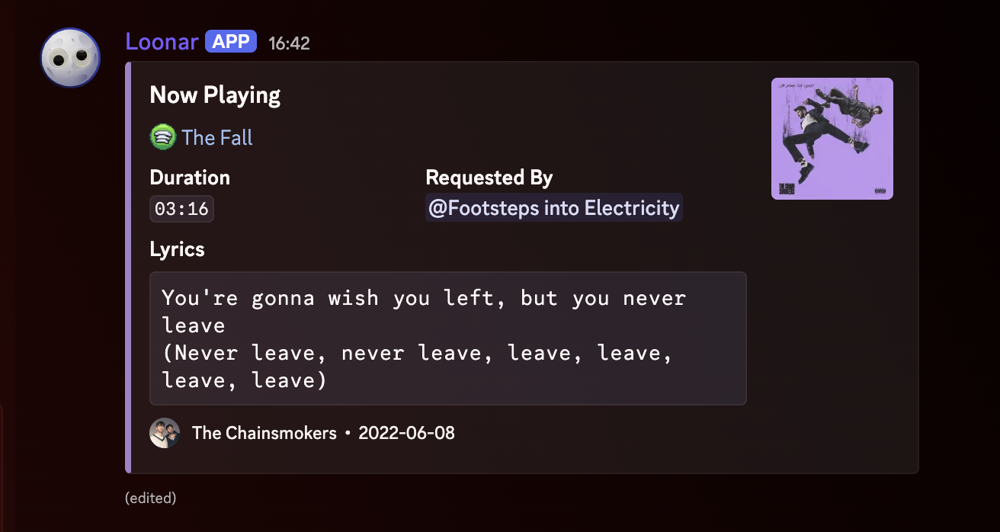
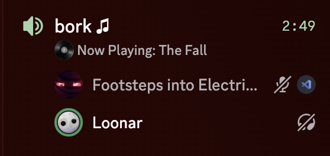
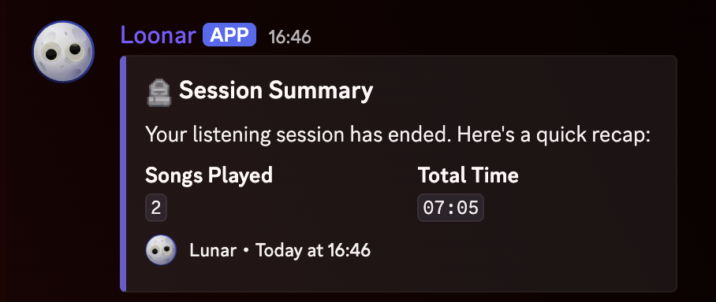

# Lunar music
### In early testing stage, feel free to create an Issue or Pull Request to contribute.

[](https://discord.js.org)
[](https://github.com/Ecliptia/moonlink.js)
[](https://nodejs.org)
[](LICENSE)
[](https://github.com/relentiousdragon/lunar-music/stargazers)
[](https://github.com/relentiousdragon/lunar-music)


a discord music bot that plays from spotify, soundcloud, deezer, apple music, tidal, and more. built with [discord.js](https://discord.js.org) and [moonlink.js](https://github.com/Ecliptia/moonlink.js).



uses **NodeLink** for audio streaming - you have to host or supply the bot with a node yourself.

> Bot's recommended for small/private instances (around **10 active servers**). If you plan to scale beyond that, you'll need to modify the source code yourself to handle sharding and larger scale workloads.

---

## Features


- **multi-platform search** - spotify (default), soundcloud, deezer, apple music, tidal
- **synced lyrics** - synced lyrics powered by [lrclib](https://lrclib.net)
- **custom branding** - customizable bot name & dynamic embed footer branding via `.env`
- **audio effects** - nightcore, vaporwave, tremolo, vibrato, rotation, lowpass, echo, karaoke
- **queue management** - paginated queue, loop (track/queue), skip, previous, back, clear
- **now playing** - embed with artwork, dominant color theming, duration, up next, artist info
- **play stats** - per-server and global leaderboards for most played tracks
- **session summary** - recap of songs played and total time when a session ends
- **playback recovery** - automatic stall detection and reconnection
- **process supervisor** - built-in child process launcher with crash detection, file logging, and restart rate limits
- **voice channel status** - shows the current track in the voice channel status bar



---

## Setup

### what you need

- [node.js](https://nodejs.org) v20 or higher
- a discord bot token ([create one here](https://discord.com/developers/applications))
- a **NodeLink** node (standard Lavalink nodes are NOT recommended - see notes below)

### install

```bash
git clone https://github.com/relentiousdragon/lunar-music.git
cd lunar-music
npm install
```

### configure

copy the example env file and fill in your values:

```bash
cp .env.example .env
```

open `.env` and add:

| variable                     | description                                             | required |
|------------------------------|---------------------------------------------------------|----------|
| `DISCORD_TOKEN`              | your bot token                                          | yes      |
| `DISCORD_APPLICATION_ID`     | optional application ID; otherwise fetched from the bot | no       |
| `DEV_USER_IDS`               | comma-separated Discord user IDs allowed to use `l.sr`  | no       |
| `NODELINK_NODES`             | nodelink node config (see format below)                 | yes      |
| `SPOTIFY_CLIENT_ID`          | optional Spotify Web API client ID                      | no       |
| `SPOTIFY_CLIENT_SECRET`      | optional Spotify Web API client secret                  | no       |
| `SPOTIFY_ACCESS_TOKEN`       | optional Spotify access token                           | no       |
| `BOT_NAME`                   | bot branding shown in embeds and Moonlink connector     | no       |
| `LOG_FORMAT`                 | console log format: `pretty` (default) or `json`        | no       |
| `DISCORD_GUILD_ID`           | optional guild ID for slash-command registration        | no       |
| `BOT_PREFIXES`               | command prefixes, comma-separated (default: `ln.,l.`)   | no       |
| `SYNCED_LYRICS_ENABLED`      | enable/disable synced lyrics (default: `true`)          | no       |
| `MAX_SYNCED_LYRICS_PLAYERS`  | max concurrent lyrics players (default: `5`, max: `20`) | no       |

**node format:**
```
identifier,host,port,password,secure
```

examples:
```bash
# single node
NODELINK_NODES=main,nodelink.example.com,3000,youshallnotpass,false

# multiple nodes (semicolon-separated)
NODELINK_NODES=main,nodelink.example.com,3000,password,false;backup,nodelink2.example.com,3000,password,false
```

### run

```bash
npm start
```

for development with auto-restart on file changes:

```bash
npm run dev
```

---

## Commmands

Commands are available through both Discord slash commands and the configured prefix (default: `l.` or `ln.`). Set `DISCORD_GUILD_ID` while developing to register slash commands to one guild immediately; omit it for global registration.

### playback
| command            | aliases               | description                      |
|--------------------|-----------------------|----------------------------------|
| `play [query/url]` | `p`                   | play a song or playlist          |
| `skip`             | `s`                   | skip the current track           |
| `back`             | `b`                   | play the previous track          |
| `previous`         | `pv`                  | view play history                |
| `seek [time]`      | `sek`, `jump`, `goto` | jump to a position (e.g. `1:30`) |
| `pause`            | `ps`                  | pause playback                   |
| `resume`           | `rs`, `unpause`       | resume playback                  |
| `stop`             | `st`                  | stop playback and leave          |
| `loop [mode]`      | `r`, `rp`, `repeat`   | cycle: off → track → queue       |

### queue
| command        | aliases               | description              |
|----------------|-----------------------|--------------------------|
| `queue [page]` | `q`                   | view the queue           |
| `clear`        | `skipall`, `sa`, `cq` | clear the queue and stop |

### effects
| command     | aliases | description             |
|-------------|---------|-------------------------|
| `nightcore` | `nc`    | speed up + pitch up     |
| `vaporwave` | `vw`    | slow down + pitch down  |
| `tremolo`   | -       | amplitude modulation    |
| `vibrato`   | -       | frequency modulation    |
| `rotation`  | -       | 8d audio effect         |
| `lowpass`   | -       | muffle high frequencies |
| `echo`      | -       | echo effect             |
| `karaoke`   | `kr`    | vocal removal           |

### stats
| command  | aliases | description                    |
|----------|---------|--------------------------------|
| `top`    | -       | server's most played songs     |
| `global` | -       | most played across all servers |

### search flags
use these with the `play` command to search on a specific platform:

| flag                       | platform                        |
|----------------------------|---------------------------------|
| `--sc` / `--soundcloud`    | soundcloud                      |
| `--dz` / `--deezer`        | deezer                          |
| `--am` / `--apple`         | apple music                     |
| `--td` / `--tidal`         | tidal                           |
| `--sr` / `--show-results`  | show top 5 results to pick from |

### other
| command   | aliases | description                                  |
|-----------|---------|----------------------------------------------|
| `help`    | `h`     | show all commands                            |
| `restart` | `fix`   | restart the player (fixes connection issues) |
| `sr`      | -       | restart the bot child process                |
| `credits` | -       | show project credits and GitHub repository   |

---

## structure

```
lunar-music/
├── assets/                   <- screenshots (now_playing, session_summary, vc_status)
├── bot.js                    <- process supervisor (crash detection, restarts & logging)
├── src/
│   ├── index.js              <- bot main entry point
│   ├── client.js             <- discord client
│   ├── manager.js            <- moonlink manager + node config
│   ├── state.js              <- shared runtime state
│   ├── events/
│   │   ├── ready.js           <- startup, presence, watchdog
│   │   ├── messageCreate.js   <- command routing
│   │   └── voiceStateUpdate.js
│   ├── commands/
│   │   ├── play.js
│   │   ├── queue.js
│   │   ├── skip.js            <- skip, previous, back
│   │   ├── playback.js        <- pause, resume, stop, seek, loop, clear, restart
│   │   ├── filters.js         <- all audio effects
│   │   ├── stats.js           <- top, global
│   │   ├── help.js
│   │   └── system.js          <- bot process restart
│   ├── handlers/
│   │   ├── trackStart.js      <- now playing embed
│   │   ├── trackEnd.js        <- session tracking, breaks
│   │   ├── trackError.js
│   │   └── playerEvents.js    <- queue end, stuck, destroy, disconnect
│   └── utils/
│       ├── branding.js        <- bot footer & name helpers
│       ├── embeds.js
│       ├── emojis.js          <- custom emoji registry & permission fallback
│       ├── format.js
│       ├── color.js
│       ├── lyrics.js
│       ├── metadata.js
│       ├── stats.js
│       ├── search.js
│       ├── voice.js
│       └── filters.js
├── .env.example
├── .gitignore
├── package.json
├── LICENSE
└── README.md
```

---

## notes

- **youtube is not supported.** youtube links and searches are blocked and cannot be enabled.
- **NodeLink vs Lavalink**: The Bot uses **NodeLink**. If you connect to a standard Lavalink node instead of NodeLink, some features may not work. If search breaks, try using direct links.
- **process supervisor (`bot.js`)**: the bot runs as a child process managed by `bot.js`. executing `l.sr` by a configured developer, or encountering an unexpected crash, causes `bot.js` to automatically restart the bot child process. `restart`/`fix` only restarts the current guild's player.
- **crash logging & limits**: crash trace logs are automatically written to `logs/error.log`. automatic restarts are limited to a maximum of 10 restarts per hour to prevent infinite crash loops.
- synced lyrics are powered by [lrclib.net](https://lrclib.net) - a free, open-source lyrics api. the `MAX_SYNCED_LYRICS_PLAYERS` setting limits how many guilds can have live lyrics at the same time to avoid hitting rate limits.
- the bot takes a 60-second connection break every hour of continuous playback to keep the audio stream stable.
- if the player gets stuck, the watchdog will automatically detect it and try to recover.

---

## License

[GPL-3.0](LICENSE)
